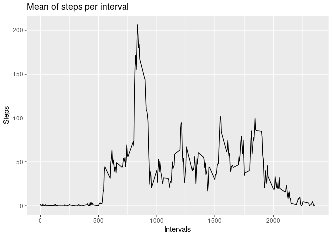

## Information regarding this work

This file has been written using RStudio and KnitR RStudio integration.  
Figures files can be found into directory <code>PA1_template_files/figure-html</code>.


## Loading and preprocessing the data
### Let's load libraries here


```r
library("readr")
library("dplyr")
```

```
## 
## Attaching package: 'dplyr'
```

```
## The following objects are masked from 'package:stats':
## 
##     filter, lag
```

```
## The following objects are masked from 'package:base':
## 
##     intersect, setdiff, setequal, union
```

```r
library("ggplot2")
```

### Data load

Let's load data from zip file using readr library.

```r
dataset <- read_delim("activity.zip",delim=",")
```

```
## Parsed with column specification:
## cols(
##   steps = col_double(),
##   date = col_date(format = ""),
##   interval = col_double()
## )
```

```r
print(dataset)
```

```
## # A tibble: 17,568 x 3
##    steps date       interval
##    <dbl> <date>        <dbl>
##  1    NA 2012-10-01        0
##  2    NA 2012-10-01        5
##  3    NA 2012-10-01       10
##  4    NA 2012-10-01       15
##  5    NA 2012-10-01       20
##  6    NA 2012-10-01       25
##  7    NA 2012-10-01       30
##  8    NA 2012-10-01       35
##  9    NA 2012-10-01       40
## 10    NA 2012-10-01       45
## # … with 17,558 more rows
```
We have a new tibble with 17568 rows and 3 columns.


## What is mean total number of steps taken per day?

### Initial grouping
We are going to group by date and do a sum of steps per date.


```r
sum_by_date <- dataset %>% group_by(date) %>% summarise(sum_steps=sum(steps, na.rm=TRUE))
```

### Plot sum of steps per day
Then we use ggplot2 to plot number of steps each day.

```r
p <- ggplot(sum_by_date, aes(x=date,y=sum_steps) ) 
p <- p + geom_col()
p <- p + xlab("Dates") + ylab("Steps") 
p <- p + ggtitle("Sum of steps per day") 

print(p)
```

<!-- -->

### Mean and Median of sum of steps per day
Now let's find mean and median

```r
my_mean <- mean(sum_by_date$sum_steps,na.rm=TRUE)
my_median <- median(sum_by_date$sum_steps,na.rm=TRUE)
print(my_mean)
```

```
## [1] 9354.23
```

```r
print(my_median)
```

```
## [1] 10395
```

Mean for total steps per day is 9354.23.  
Median for total steps per day is 10395.00.  


## What is the average daily activity pattern?

### Grouping by interval
We are going to group by interval and find the average number of steps for each interval.
As there are 288 intervals of 5 minutes in a day (60*24 minutes / 5 = 288).
We should find 288 interval in the generated data.


```r
avg_by_interval <- dataset %>% group_by(interval) %>% summarise(avg_steps=mean(steps, na.rm=TRUE))
summary(avg_by_interval)
```

```
##     interval        avg_steps      
##  Min.   :   0.0   Min.   :  0.000  
##  1st Qu.: 588.8   1st Qu.:  2.486  
##  Median :1177.5   Median : 34.113  
##  Mean   :1177.5   Mean   : 37.383  
##  3rd Qu.:1766.2   3rd Qu.: 52.835  
##  Max.   :2355.0   Max.   :206.170
```

```r
print(avg_by_interval)
```

```
## # A tibble: 288 x 2
##    interval avg_steps
##       <dbl>     <dbl>
##  1        0    1.72  
##  2        5    0.340 
##  3       10    0.132 
##  4       15    0.151 
##  5       20    0.0755
##  6       25    2.09  
##  7       30    0.528 
##  8       35    0.868 
##  9       40    0     
## 10       45    1.47  
## # … with 278 more rows
```

We are good :)

### Plot sum steps by interval
Let's plot this data in a time series plot


```r
p <- ggplot(avg_by_interval, aes(x=interval,y=avg_steps) ) 
p <- p + geom_col()
p <- p + xlab("Intervals") + ylab("Steps") 
p <- p + ggtitle("Mean of steps per interval") 

print(p)
```

<!-- -->


### Maximum
Let's find the maximum average steps.


```r
max_steps <- max(avg_by_interval$avg_steps)
print(max_steps)
```

```
## [1] 206.1698
```

```r
max_row <- which.max(avg_by_interval$avg_steps)
max_interval <- as.integer(avg_by_interval[max_row,][,1])
```

The maximum avergae steps per interval is  206.1698.  
The interval when it occures is 835. 


## Imputing missing values

### Are there any missing values ? 
The dataset containes missing values:  


```r
missing <- is.na(dataset$steps)

n_missing <- sum(missing)
```

The total missing values for steps is 2304.

### Let's fill the gapes !

We can replace these missing values by mean of the same interval. We allready have theses values from avg_by_interval.   
Let's create a new dataset, with a new column named new_steps.  


```r
newdataset <- dataset %>% mutate( new_steps = ifelse(is.na(steps),
                                                     pull(avg_by_interval[interval,2]),
                                                     steps) )

print(newdataset)
```

```
## # A tibble: 17,568 x 4
##    steps date       interval new_steps
##    <dbl> <date>        <dbl>     <dbl>
##  1    NA 2012-10-01        0    0.0755
##  2    NA 2012-10-01        5    1.47  
##  3    NA 2012-10-01       10    0.151 
##  4    NA 2012-10-01       15    0.170 
##  5    NA 2012-10-01       20    0     
##  6    NA 2012-10-01       25    0.132 
##  7    NA 2012-10-01       30    1.55  
##  8    NA 2012-10-01       35    0     
##  9    NA 2012-10-01       40    0.491 
## 10    NA 2012-10-01       45    0.943 
## # … with 17,558 more rows
```
It worked :)

### Sum of steps per day 

Let's create a new group by dataset using the new column instead of the oirginal one with missing values.

```r
sum_by_date <- newdataset %>% group_by(date) %>% summarise(sum_steps=sum(new_steps, na.rm=TRUE))
print(sum_by_date)
```

```
## # A tibble: 61 x 2
##    date       sum_steps
##    <date>         <dbl>
##  1 2012-10-01     1451.
##  2 2012-10-02      126 
##  3 2012-10-03    11352 
##  4 2012-10-04    12116 
##  5 2012-10-05    13294 
##  6 2012-10-06    15420 
##  7 2012-10-07    11015 
##  8 2012-10-08     1451.
##  9 2012-10-09    12811 
## 10 2012-10-10     9900 
## # … with 51 more rows
```


Then we use ggplot2 to plot number of steps each day.

```r
p <- ggplot(sum_by_date, aes(x=date,y=sum_steps) ) 
p <- p + geom_col()
p <- p + xlab("Dates") + ylab("Steps") 
p <- p + ggtitle("Sum of steps per day") 

print(p)
```

<!-- -->


### Impact on Mean and Median 
Now let's find mean and median for this new dataset.

```r
my_new_mean <- mean(sum_by_date$sum_steps,na.rm=TRUE)
my_new_median <- median(sum_by_date$sum_steps,na.rm=TRUE)
print(my_new_mean)
```

```
## [1] 9545.514
```

```r
print(my_new_median)
```

```
## [1] 10395
```

Mean for total steps per day is now 9545.514 as it was 9354.23.  
Median for total steps per day is now 10395.00 as it was 10395.00.  


The mean is changed by the following percentage: 2.04.
The impact is small.


## Are there differences in activity patterns between weekdays and weekends?

### Create a new factor column containing 'day type'
Let's create this new column with weekday or weekend values.


```r
week_days <- c('Monday','Tuesday','Wednesday','Thursday','Friday')
weekend_days <- c('Saturday','Sunday')

new <- newdataset %>% mutate( day = factor( 
                                    case_when( weekdays(date) %in% week_days ~ "Weekday",  
                                               weekdays(date) %in% weekend_days ~ "Weekend") ) ) 
```

And convert it to a factor.


```r
new$day <- as.factor(new$day)
print(new)
```

```
## # A tibble: 17,568 x 5
##    steps date       interval new_steps day    
##    <dbl> <date>        <dbl>     <dbl> <fct>  
##  1    NA 2012-10-01        0    0.0755 Weekday
##  2    NA 2012-10-01        5    1.47   Weekday
##  3    NA 2012-10-01       10    0.151  Weekday
##  4    NA 2012-10-01       15    0.170  Weekday
##  5    NA 2012-10-01       20    0      Weekday
##  6    NA 2012-10-01       25    0.132  Weekday
##  7    NA 2012-10-01       30    1.55   Weekday
##  8    NA 2012-10-01       35    0      Weekday
##  9    NA 2012-10-01       40    0.491  Weekday
## 10    NA 2012-10-01       45    0.943  Weekday
## # … with 17,558 more rows
```

Let's group steps per day and interval and apply the mean function to this groups.


```r
avg_by_interval <- new %>% group_by(interval,day) %>% summarise( avg_steps = mean( new_steps, na.rm=TRUE ) )
summary(avg_by_interval)
```

```
##     interval           day        avg_steps      
##  Min.   :   0.0   Weekday:288   Min.   :  0.000  
##  1st Qu.: 588.8   Weekend:288   1st Qu.:  3.884  
##  Median :1177.5                 Median : 27.310  
##  Mean   :1177.5                 Mean   : 39.755  
##  3rd Qu.:1766.2                 3rd Qu.: 62.206  
##  Max.   :2355.0                 Max.   :234.103
```

```r
print(avg_by_interval)
```

```
## # A tibble: 576 x 3
## # Groups:   interval [288]
##    interval day     avg_steps
##       <dbl> <fct>       <dbl>
##  1        0 Weekday     2.97 
##  2        0 Weekend     1.56 
##  3        5 Weekday     1.11 
##  4        5 Weekend     0    
##  5       10 Weekday     0.700
##  6       10 Weekend     0    
##  7       15 Weekday     0.851
##  8       15 Weekend     0    
##  9       20 Weekday     3.94 
## 10       20 Weekend     0    
## # … with 566 more rows
```


### Let's plot all that

We will use ggplot2 with 2 facets, using day factor.


```r
g <- ggplot(avg_by_interval, aes(x=interval,y=avg_steps) ) 
g <- g + geom_line(alpha=1/2, color="blue") 
g <- g + facet_wrap( . ~ day, nrow=2, ncol=1 ) 
g <- g + theme_gray(base_family = "Avenir", base_size=10)
g <- g + labs(x=" Interval ") + labs(y="Number of Steps" ) 

print(g)
```

<!-- -->


People are walking early and more in the morning ( to go to the office ? ) in the week days compare to weekend days.  People are also walking more in the day during week-end days.
